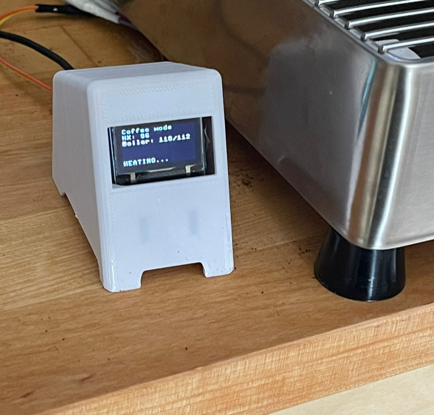
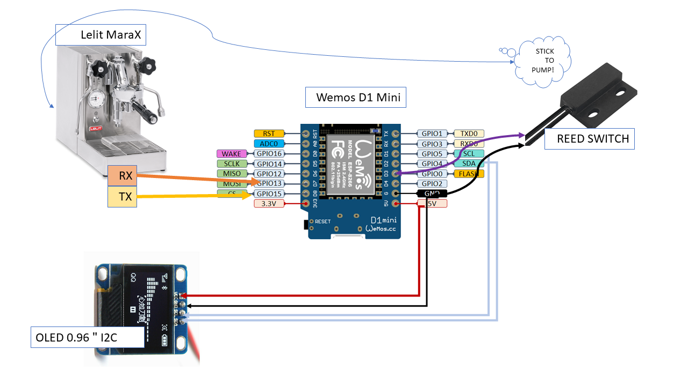

# Pimp My Mara-X

[Lelit PL62x (Mara-X)](https://marax.lelit.com/) Espresso Machine enhancments, made in pursuit of getting a better understanding of their unique "Coffee Priority Mode" behaviour.
Inspired by projects such as [marax_monitor](https://github.com/bancbanus/marax_monitor) and [marax_timer](https://github.com/alexrus/marax_timer)

## My Setup

Currently I'm just using old components laying out in my house.

* RaspberryPI-4 that powers my [HomeAssistant](https://www.home-assistant.io/) installation, and also an MQTT broker ([mosquitto](https://pimylifeup.com/raspberry-pi-mosquitto-mqtt-server/))
* A WiFi smart outlet that is managed by HomeAssitant to control the coffee machine power.
* For my [MaraX Monitor](#esp8266-monitor), I use Wemos D1 Mini (ESP8266) clone. see the next section for more detail.
## ESP8266 monitor



### Hardware

I use a Wemos D1 Mini clone, and hook it up to the TX/RX connections in the MaraX's Gicar control unit. (see this [Reddit post](https://www.reddit.com/r/espresso/comments/hft5zv/data_visualisation_lelit_marax_mod/) for more information)

Display: SSD1306 compatible 0.96 OLED display (i2c)
Also glued a reed sensor to the pump to implement a shot timer, simillar to https://github.com/alexrus/marax_timer/.

Currently 3D printed [this case](https://www.thingiverse.com/thing:2934049) for ESP8266 and SSD1306 display



#### Common-Ground (TODO)
Currently there are "errors" in the UART communication in my machine which I handle in software, not too frequent but still present.
It could be either faulty soldering in my ESP8266, or the lack of common ground between the ESP8266 and The Gicar control unit on the Marax.

### Software

It is advised to read through the code if you intend to use this project for yourselves.
The software for the ESP8266 can be found in the [./board]([./board]) directory and is powered by [MicroPython](https://micropython.org/).

The upstream micropython builds do not include the SoftUART support for ESP8266, so I'm using this [MicroPython fork](https://github.com/MrJake222/micropython) meanwhile.
Building it is no easy feat since most Dockerfiles & Vagrants for provisioning the esp8266 sdk tools for micropython are broken in one way or another :/

Once you flash this MicroPython fork on your ESP, you'll need to create a `config.py` file in this directory and fill in some values, see [](./board/config.py.template).

If you have an MQTT broker set up, you can configure `MQTT_BROKER` in `config.py` to its hostname and the MCU will publish the results to `marax/uart` topic.

Make sure to run `./upload.sh` to upload all the micropython scripts to the ESP8266.

## HomeAssistant


After MQTT is set up, I can simply add these sensors to my HomeAssistant's `configuration.yaml`:
```yaml

mqtt:
  broker: localhost
  discovery: false

sensor:
  - platform: mqtt
    name: "Coffee Machine - HX"
    state_topic: "marax/uart"
    unit_of_measurement: "°C"
    value_template: "{{ value_json.hx_temp }}"
    expire_after: 5
  - platform: mqtt
    name: "Coffee Machine - Boiler"
    state_topic: "marax/uart"
    unit_of_measurement: "°C"
    value_template: "{{ value_json.boiler_temp }}"
    expire_after: 5
  - platform: mqtt
    name: "Coffee Machine - Boiler (Target)"
    state_topic: "marax/uart"
    unit_of_measurement: "°C"
    value_template: "{{ value_json.boiler_target }}"
    expire_after: 5
```
