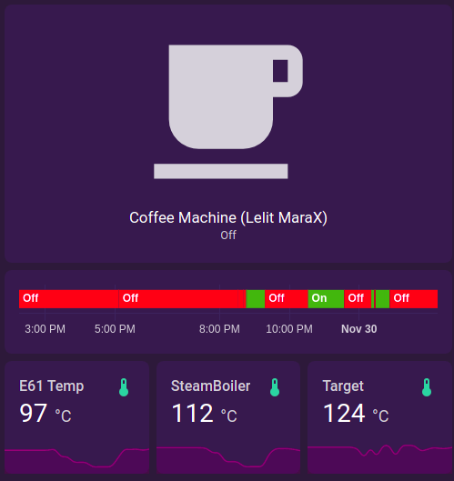

# Pimp My Mara-X

[Lelit PL62x (Mara-X)](https://marax.lelit.com/) Espresso Machine enhancments, made in pursuit of getting a better understanding of their unique "Coffee Priority Mode" behaviour.
Inspired by projects such as [marax_monitor](https://github.com/bancbanus/marax_monitor) and [marax_timer](https://github.com/bancbanus/marax_monitor)


## My Setup

Currently I'm just using old components laying out in my house.

* RaspberryPI-4 that powers my [HomeAssistant](https://www.home-assistant.io/) installation, and also an MQTT broker ([mosquitto](https://pimylifeup.com/raspberry-pi-mosquitto-mqtt-server/))
* A WiFi smart outlet that is managed by HomeAssitant to control the coffee machine power.
* For my [MaraX Sensor](./sensor/README.md), I use Wemos D1 Mini (ESP8266) clone. see the `sensor` directory for more.

After MQTT is set up, I can simply add these sensors to my HomeAssistant's `configuration.yaml`:
```yaml

mqtt:
  broker: localhost
  discovery: false

sensor:
  - platform: mqtt
    name: "Coffee Machine - HX"
    state_topic: "marax/uart"
    unit_of_measurement: "°C"
    value_template: "{{ value_json.hx_temp }}"
  - platform: mqtt
    name: "Coffee Machine - Boiler"
    state_topic: "marax/uart"
    unit_of_measurement: "°C"
    value_template: "{{ value_json.boiler_temp }}"
  - platform: mqtt
    name: "Coffee Machine - Boiler (Target)"
    state_topic: "marax/uart"
    unit_of_measurement: "°C"
    value_template: "{{ value_json.boiler_target }}"
```

This is my current result:

